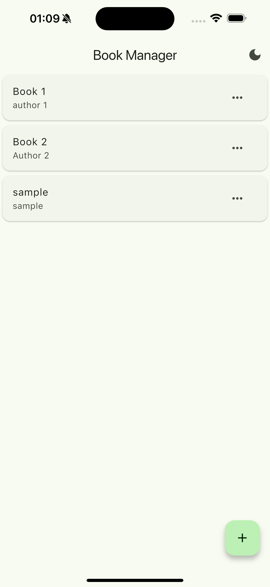
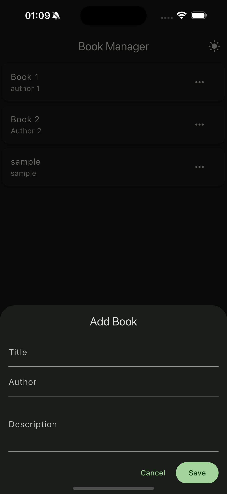
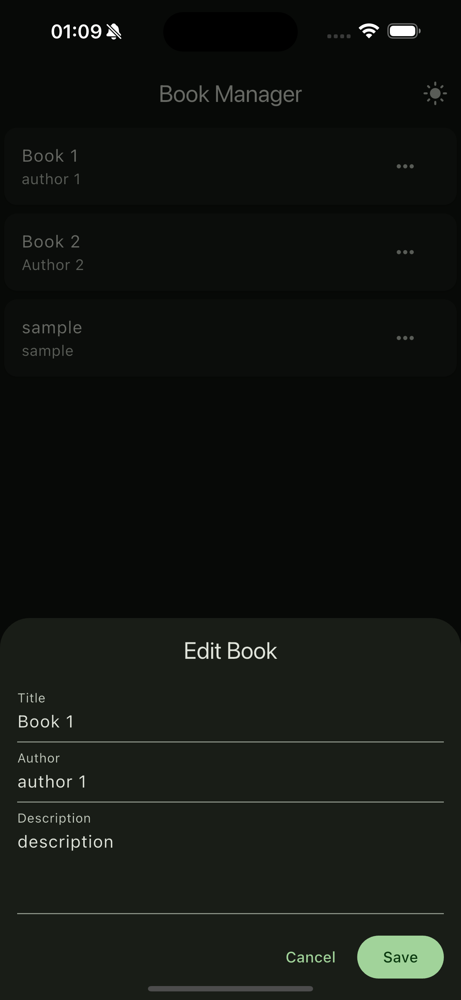
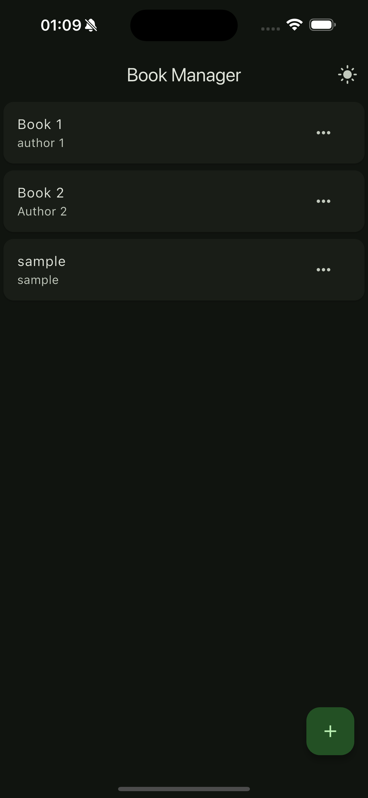
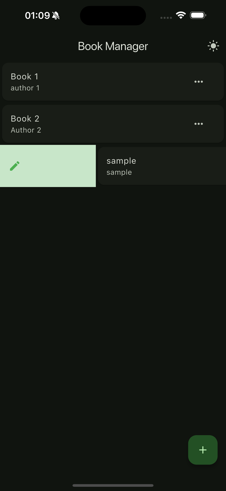
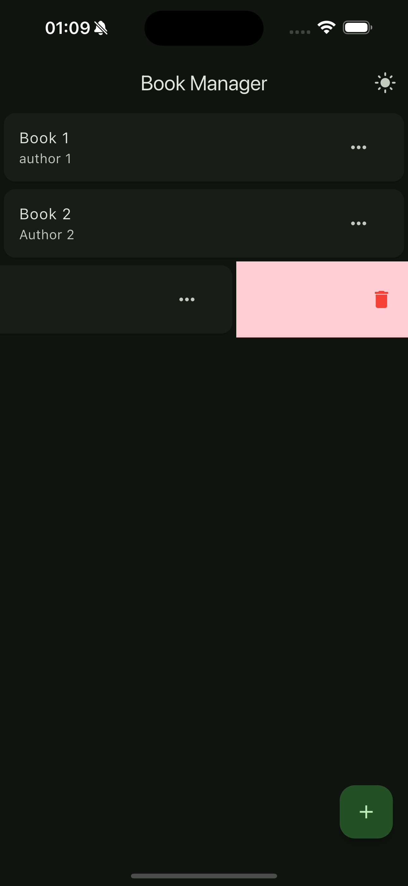
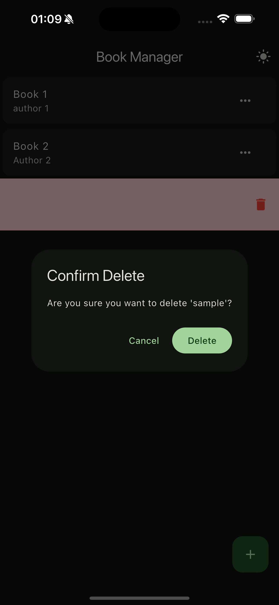

# Book Management App

A Flutter application for managing your book collection with Material Design 3 implementation.

## Features

- Create, Read, Update, and Delete books (CRUD operations)
- Material Design 3 with dynamic theming
- Dark/Light mode toggle
- Swipe actions for quick edit and delete
- Confirmation dialogs for delete operations
- Bottom sheet forms for adding/editing books
- Responsive design

## Screenshots

### Light Mode
<div style="display: flex; gap: 10px;">
    
    
    
</div>

### Actions & Dark Mode
<div style="display: flex; gap: 10px;">
    
    
    
</div>

### Confirmations
<div style="display: flex; gap: 10px;">
    
</div>

## Getting Started

1. Clone the repository
```bash
git clone https://github.com/dizzpy/Book-Management-Assignment.git
```

2. Install dependencies
```bash
flutter pub get
```

3. Run the app
```bash
flutter run
```

## Features Details

### Book Management
- Add new books with title, author, and description
- View list of all books
- Edit existing book details
- Delete books with confirmation

### Gesture Controls
- Swipe right to edit
- Swipe left to delete
- Tap menu for additional options

### UI/UX
- Material Design 3 components
- Dynamic color theming
- Responsive bottom sheets
- Smooth animations
- Dark/Light theme toggle

## Dependencies

- Flutter SDK
- provider: ^6.0.5 (State Management)

## Project Structure

```
lib/
├── models/
│   └── book.dart
├── providers/
│   ├── book_provider.dart
│   └── theme_provider.dart
├── screens/
│   └── book_list_screen.dart
└── main.dart
```

## Contributing

1. Fork the repository
2. Create your feature branch (`git checkout -b feature/AmazingFeature`)
3. Commit your changes (`git commit -m 'Add some AmazingFeature'`)
4. Push to the branch (`git push origin feature/AmazingFeature`)
5. Open a Pull Request

## License

This project is licensed under the MIT License - see the LICENSE file for details
